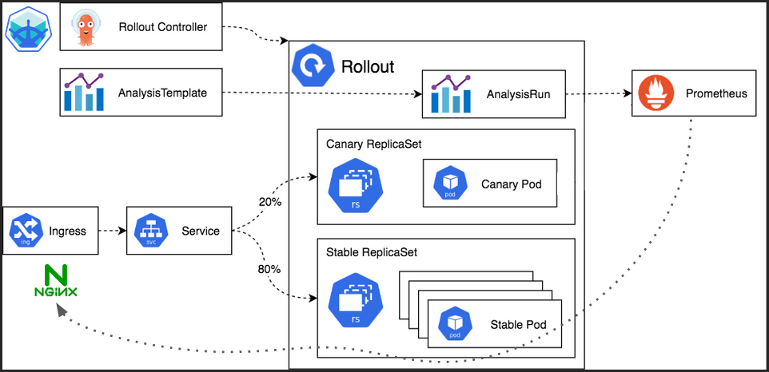

# 🐙 Argo Rollouts
Este repo contiene los archivos utilizados en la charla "Argo Rollouts: deployando en kubernetes como un pro" dictada en la 10ma edición de la Nerdearla. [Link a la charla](https://www.youtube.com/watch?v=sIprvJ2i1lg).

## 📖 Introducción
Argo Rollouts nos permite extender las estrategias de upgrade de los deployments en Kubernetes, en el siguiente repo se van a encontrar los archivos necesarios para desplegar un rollout con una imágen demo del proyecto Argo y hacer un test al momento de actualizar.

## 🏢 Arquitectura
La arquitectura a desplegar en nuestro cluster de Kubernetes es la siguiente:

### Canary

- **Rollout:** migramos nuestro deployment a rollout lo que nos va a permitir implementar los distintos services, steps en la actualización y el análisis.

- **Analisis Template:** nos permite crear un test a nuestro rollout que se corre cuando se haga una actualización. Este test se va implementar a partir de una fórmula de aceptación con metricas de prometheus (que va a leer requests de nginx).

### Prometheus

- **Prometheus-values:** se necesita configurar la integración de nginx con prometheus para que pueda leer las métricas de nginx y conocer los status code de las requests.